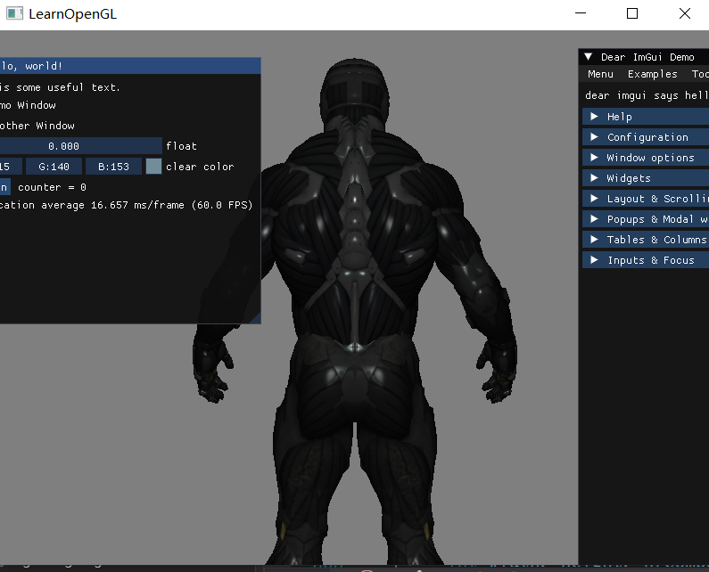
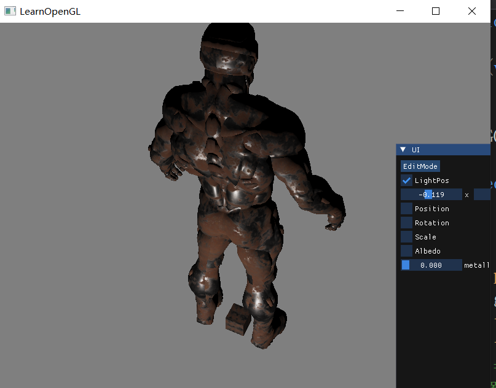
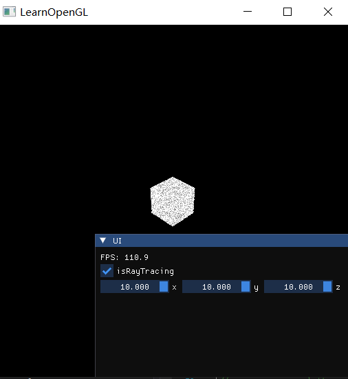
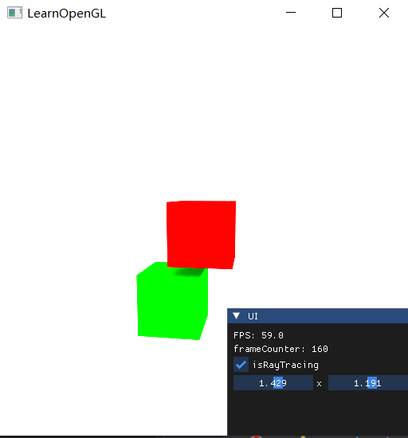

# OpenglCAD

20240630
模型导入参考

https://blog.csdn.net/qq_34060370/article/details/129468505?ops_request_misc=%257B%2522request%255Fid%2522%253A%2522171974657316800197076343%2522%252C%2522scm%2522%253A%252220140713.130102334..%2522%257D&request_id=171974657316800197076343&biz_id=0&utm_medium=distribute.pc_search_result.none-task-blog-2~all~top_click~default-1-129468505-null-null.142^v100^control&utm_term=Assimp&spm=1018.2226.3001.4187

imgui导入参考

https://blog.csdn.net/sdgfafg_25/article/details/136450833?ops_request_misc=%257B%2522request%255Fid%2522%253A%2522171976111116800213022488%2522%252C%2522scm%2522%253A%252220140713.130102334..%2522%257D&request_id=171976111116800213022488&biz_id=0&utm_medium=distribute.pc_search_result.none-task-blog-2~all~baidu_landing_v2~default-2-136450833-null-null.142^v100^control&utm_term=C%2B%2B%20imgui&spm=1018.2226.3001.4187

2024/7/4 加入部分UI，加入PBR

2024/7/6 加入GPU版光线追踪
参考
https://github.com/AKGWSB/EzRT

帧缓冲累积
